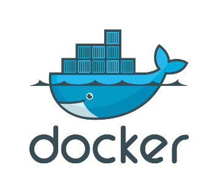

## Docker
  

Docker è utile sia per gli sviluppatori che per i sistemisti: semplifica il building, lo shipping e il running delle applicazioni. Sviluppa, testa, personalizza il tuo servizio e rendilo disponibile e portabile in modo rapido ed efficiente in ambienti eterogenei. Docker consente agli sviluppatori e agli amministratori di sistema di costruire, inviare ed eseguire applicazioni distribuite in qualunque contesto, garantendo agilità, portablità e controllo: l'applicazione verrà sempre eseguita allo stesso modo, qualunque sia l'ambiente in cui si trovi.  

