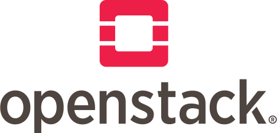

## OpenStack
  
Con OpenStack non dipendi dai Big Tech. Realizzi i tuoi IaaS e PaaS su misura, tieni al riparo da occhi indiscreti i tuoi dati, costruisci infrastrutture complesse ed indipendenti fra loro.
OpenStack consente di gestire con un unico set di API qualunque tipo di risorsa IT, tra le altre:
* VM
* container
* volumi
* componenti di rete
* servizi di rete
* immagini
* secrets
* database
* workflow
* accessi
* telemetria
* orchestrazione
* indirizzi IP
* policy di sicurezza  

